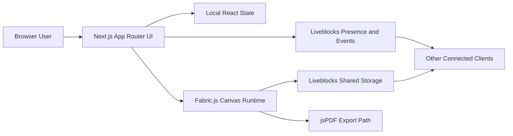
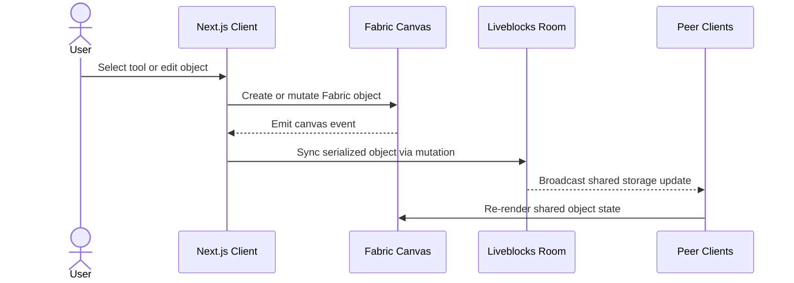

# FigPro

Real-time collaborative whiteboard built with Next.js, TypeScript, Fabric.js, and Liveblocks.

Maintained by [Mykhailo Yarytskiy](https://github.com/mmmihaeel).

## Documentation Index

- [Architecture Deep Dive](./docs/ARCHITECTURE.md)
- [Security Policy and Hardening Guide](./SECURITY.md)
- [MIT License](./LICENSE)

## Table of Contents

1. [Executive Summary](#executive-summary)
2. [Capability Matrix](#capability-matrix)
3. [System Architecture](#system-architecture)
4. [Collaboration Model](#collaboration-model)
5. [Repository Layout](#repository-layout)
6. [Local Development](#local-development)
7. [Operational Notes](#operational-notes)
8. [Security at a Glance](#security-at-a-glance)
9. [License](#license)

## Executive Summary

FigPro is a portfolio-grade collaborative canvas application inspired by modern design and whiteboarding tools. It combines a Fabric.js drawing surface with Liveblocks-powered presence and synchronized storage, allowing multiple users to interact with a shared canvas in real time.

The codebase is intentionally small enough to review quickly while still demonstrating production-relevant engineering concerns:

- event-driven canvas orchestration
- synchronization of shared document state
- collaborative presence and comment overlays
- modular UI composition with reusable controls
- secure handling of environment configuration for public source distribution

## Capability Matrix

| Capability Area    | What the Application Supports                                            | Primary Files                                                                     |
| ------------------ | ------------------------------------------------------------------------ | --------------------------------------------------------------------------------- |
| Canvas editing     | Shape creation, free drawing, text, selection, scaling, moving, clearing | `app/App.tsx`, `lib/canvas.ts`, `lib/shapes.ts`                                   |
| Collaboration      | Live cursors, active users, reactions, shared room state                 | `components/Live.tsx`, `components/users/ActiveUsers.tsx`, `liveblocks.config.ts` |
| Comments           | Pinned comment threads over the canvas                                   | `components/comments/*`, `liveblocks.config.ts`                                   |
| Property editing   | Fill, stroke, dimensions, typography, z-order actions                    | `components/RightSidebar.tsx`, `components/settings/*`                            |
| Export             | PDF export of the current design surface                                 | `components/settings/Export.tsx`, `lib/utils.ts`                                  |
| Keyboard workflows | Undo, redo, delete, copy, paste, collaboration shortcuts                 | `lib/key-events.ts`, `constants/index.ts`                                         |

## System Architecture

High-level runtime view:



Key architectural properties:

| Concern                       | Current Approach                                                                         | Why It Matters                                                         |
| ----------------------------- | ---------------------------------------------------------------------------------------- | ---------------------------------------------------------------------- |
| Rendering model               | Client-side canvas rendering with `dynamic(..., { ssr: false })`                         | Prevents server-side rendering issues for Fabric.js canvas operations  |
| Shared document state         | Liveblocks `LiveMap` stores serialized canvas objects                                    | Keeps the canvas synchronized across active sessions                   |
| Presence and ephemeral events | Live cursors, reactions, and user presence remain separate from persisted canvas objects | Avoids polluting document history with transient collaboration signals |
| UI composition                | Toolbar, sidebars, comments, and collaboration controls are isolated by feature          | Keeps the editing surface maintainable and easier to extend            |

For the full component and state model, see [docs/ARCHITECTURE.md](./docs/ARCHITECTURE.md).

## Collaboration Model

The application separates collaborative data into persistent and non-persistent channels:

| Data Type      | Persistence                            | Transport                   | Examples                                 |
| -------------- | -------------------------------------- | --------------------------- | ---------------------------------------- |
| Canvas objects | Persistent for the active room session | Liveblocks storage          | Shapes, text elements, object metadata   |
| Presence       | Ephemeral                              | Liveblocks presence         | Cursor position, cursor mode             |
| Events         | Ephemeral                              | Liveblocks broadcast events | Reactions and real-time activity pings   |
| Comments       | Persistent                             | Liveblocks comments APIs    | Thread metadata, pinned discussion state |

Typical edit flow:



## Repository Layout

| Path             | Responsibility                                                                       |
| ---------------- | ------------------------------------------------------------------------------------ |
| `app/`           | Root layout, room bootstrapping, and the top-level canvas experience                 |
| `components/`    | Collaboration UI, sidebars, comments, cursor layers, and reusable controls           |
| `constants/`     | Toolbar definitions, shortcut mappings, and UI option sets                           |
| `hooks/`         | Small reusable React hooks                                                           |
| `lib/`           | Canvas orchestration, keyboard handling, export helpers, and serialization utilities |
| `public/assets/` | Static SVGs, icons, logo, and other client assets                                    |
| `types/`         | Shared TypeScript models used across rendering and collaboration code                |
| `docs/`          | Architecture and engineering documentation for maintainers and reviewers             |

## Local Development

### Prerequisites

| Tool    | Recommended Version |
| ------- | ------------------- |
| Node.js | 18 or newer         |
| npm     | 9 or newer          |

### Install Dependencies

```bash
npm install
```

### Environment Variables

Create `.env.local` based on `.env.example`, then populate the required value:

| Variable                            | Required | Description                                                                    |
| ----------------------------------- | -------- | ------------------------------------------------------------------------------ |
| `NEXT_PUBLIC_LIVEBLOCKS_PUBLIC_KEY` | Yes      | Client-side Liveblocks public key used to connect to the collaboration backend |

```env
NEXT_PUBLIC_LIVEBLOCKS_PUBLIC_KEY=your_liveblocks_public_key
```

### Development Commands

| Command         | Purpose                      |
| --------------- | ---------------------------- |
| `npm run dev`   | Start the development server |
| `npm run build` | Build a production bundle    |
| `npm run start` | Run the production bundle    |
| `npm run lint`  | Run ESLint checks            |

Application entrypoint: `http://localhost:3000`

## Operational Notes

| Topic                | Notes                                                                                                                      |
| -------------------- | -------------------------------------------------------------------------------------------------------------------------- |
| Runtime assumptions  | The canvas runs entirely on the client and depends on browser APIs unavailable during SSR                                  |
| Authentication model | Current implementation uses a public Liveblocks key and does not include a custom auth backend                             |
| Packaging model      | The repository is public, but `package.json` remains `private` because this is an application, not a published npm package |
| Assets               | Static icons and logos are stored locally under `public/assets/` for deterministic builds                                  |

## Security at a Glance

This repository is safe to publish as source code, but a production deployment should still be hardened. The current posture is:

| Area               | Current State                                            | Recommended Production Hardening                                                     |
| ------------------ | -------------------------------------------------------- | ------------------------------------------------------------------------------------ |
| Secrets            | Local environment files are git-ignored                  | Keep secrets in deployment platform secret stores                                    |
| Liveblocks access  | Public client key only                                   | Add authenticated room authorization for non-demo deployments                        |
| Input handling     | Canvas actions are constrained by application code paths | Add stricter upload validation, rate limiting, and server-side auth where applicable |
| Dependency hygiene | Lockfile is committed for deterministic installs         | Regularly review `npm audit`, renovate dependencies, and pin deployment artifacts    |

Full guidance is documented in [SECURITY.md](./SECURITY.md).

## License

This project is licensed under the MIT License. See [LICENSE](./LICENSE).
