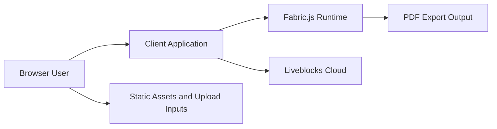

# Security Policy

## Supported Versions

| Version | Supported |
| ------- | --------- |
| 1.0.x   | Yes       |

## Security Overview

FigPro is published as a public portfolio application. The repository is safe to share, but its current collaboration model is intentionally lightweight and should be hardened before use in a sensitive or multi-tenant production environment.

## Threat Model

## Trust Boundaries

| Boundary                    | What Crosses It                                     | Risk                                                        |
| --------------------------- | --------------------------------------------------- | ----------------------------------------------------------- |
| Browser user -> application | Pointer events, keyboard input, file uploads        | Malicious input, oversized payloads, abusive usage patterns |
| Application -> Liveblocks   | Presence updates, shared object mutations, comments | Unauthorized room access if authentication is weak          |
| Application -> local export | User-generated canvas data exported to PDF          | Data leakage through locally shared artifacts               |

## Current Security Posture

| Area                        | Current Posture                               | Notes                                                                      |
| --------------------------- | --------------------------------------------- | -------------------------------------------------------------------------- |
| Secret management           | Local environment files are excluded from git | `.env` and `.env.local` stay outside version control                       |
| Client credentials          | Uses `NEXT_PUBLIC_LIVEBLOCKS_PUBLIC_KEY`      | This is a public client key, not a server secret                           |
| Authorization               | No custom backend authorization layer         | Suitable for demos, not sufficient for sensitive production access control |
| Front-end only architecture | No server-side privileged actions             | Limits backend attack surface, but also limits enforceable auth policies   |
| Dependency pinning          | Lockfile committed                            | Improves deterministic installs and reviewability                          |

## Production Hardening Recommendations

| Control Area       | Recommendation                                                                                   |
| ------------------ | ------------------------------------------------------------------------------------------------ |
| Authentication     | Use a secure backend-issued Liveblocks auth flow instead of relying only on a public client key  |
| Authorization      | Enforce room ownership, access policies, and invite or membership checks                         |
| Upload handling    | Validate file type, file size, and content before allowing uploads in production workflows       |
| Rate limiting      | Apply rate limiting to auth, room creation, and comment mutation endpoints once a backend exists |
| Session identity   | Resolve users from a trusted identity provider instead of anonymous or inferred client identity  |
| Observability      | Add structured error monitoring and audit trails for collaboration events                        |
| Dependency hygiene | Review `npm audit` output regularly and patch vulnerable transitive dependencies                 |
| Supply chain       | Pin CI Node.js versions, use lockfile-only installs in CI, and protect release workflows         |

## Secure Configuration Guidance

| Topic             | Guidance                                                                  |
| ----------------- | ------------------------------------------------------------------------- |
| Environment files | Keep `.env`, `.env.local`, and deployment secrets in secret stores only   |
| Public variables  | Treat `NEXT_PUBLIC_*` variables as visible to the browser bundle          |
| Git hygiene       | Never commit API secrets, private room tokens, or deployment credentials  |
| Release process   | Tag from reviewed commits only and avoid force-moving public release tags |

## Collaboration-Specific Risks

| Risk                          | Why It Matters                                                | Mitigation                                          |
| ----------------------------- | ------------------------------------------------------------- | --------------------------------------------------- |
| Unauthenticated room access   | Anyone with room knowledge may connect if access is not gated | Add backend-issued room authorization               |
| Collaborative abuse           | Cursors, comments, or reactions can be abused in open rooms   | Add authenticated identity and moderation controls  |
| Oversized document state      | Large object payloads can affect performance and cost         | Validate object sizes and introduce document quotas |
| Client-side trust assumptions | Browser code cannot enforce strong authorization by itself    | Move privileged checks to backend services          |

## Secure Deployment Checklist

| Checklist Item                         | Status for Current Repo |
| -------------------------------------- | ----------------------- |
| Secrets excluded from git              | Yes                     |
| Public license present                 | Yes                     |
| Security guidance documented           | Yes                     |
| Backend authorization implemented      | No                      |
| Rate limiting implemented              | No                      |
| Centralized monitoring implemented     | No                      |
| Automated security scanning configured | Not in this repository  |

## Reporting a Vulnerability

Please do not open a public issue for a sensitive vulnerability.

Preferred reporting path:

1. Use GitHub private vulnerability reporting if it is enabled for the repository.
2. If private reporting is unavailable, contact the maintainer through the GitHub profile linked in the repository metadata.

When reporting an issue, include:

- a concise description of the vulnerability
- affected files or flows
- reproduction steps
- impact assessment
- any suggested remediation
