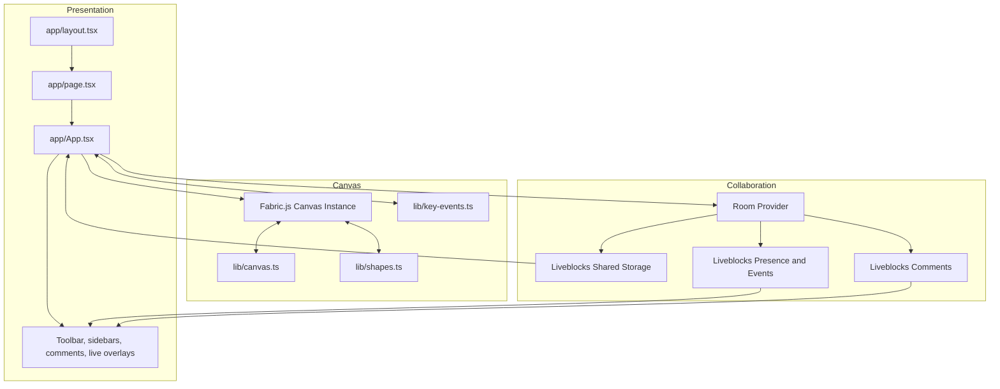
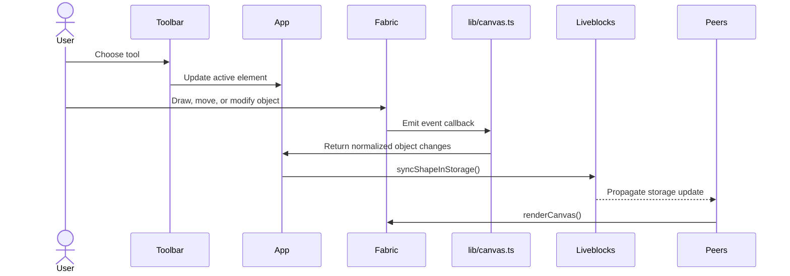

# Architecture

## Overview

FigPro is a client-rendered collaborative whiteboard application with a clear separation between:

- view composition and interaction controls
- canvas orchestration and Fabric.js event handling
- collaborative persistence and presence through Liveblocks
- utility modules that translate runtime events into synchronized document state

The architecture intentionally favors explicit module boundaries over framework indirection so the full interaction model can be understood by reading a small set of files.

## Design Goals

| Goal                                                 | Implementation Strategy                                                        |
| ---------------------------------------------------- | ------------------------------------------------------------------------------ |
| Keep the editing surface responsive                  | Fabric.js owns low-level canvas interaction while React manages surrounding UI |
| Synchronize shared state across users                | Liveblocks `LiveMap` persists serialized canvas objects                        |
| Separate transient collaboration from document state | Presence and reactions are stored outside persisted object storage             |
| Keep the application approachable for maintenance    | The core orchestration stays concentrated in `app/App.tsx` and `lib/`          |

## Layered View

## Runtime Flow

### Boot Sequence

1. `app/layout.tsx` initializes global metadata, fonts, and the `Room` wrapper.
2. `app/page.tsx` loads the canvas experience with SSR disabled.
3. `app/Room.tsx` configures the Liveblocks room provider and shared storage.
4. `app/App.tsx` creates the Fabric.js canvas instance and wires event listeners.
5. UI components render around the canvas and bind to local state or collaborative state depending on responsibility.

### Object Editing Sequence

## State Ownership Model

| State Category        | Owner                          | Examples                                               | Persistence                               |
| --------------------- | ------------------------------ | ------------------------------------------------------ | ----------------------------------------- |
| Local UI state        | React component state and refs | Active tool, selected object attributes, drawing mode  | In-memory only                            |
| Canvas runtime state  | Fabric.js instance             | Rendered objects, selection state, transforms          | Derived from storage and user interaction |
| Shared document state | Liveblocks storage             | Serialized canvas objects keyed by `objectId`          | Shared and synchronized                   |
| Presence state        | Liveblocks presence            | Cursor position, cursor mode, ephemeral identity hints | Non-persistent                            |
| Comment state         | Liveblocks comments APIs       | Thread metadata, pinned thread positions               | Persistent within the room model          |

## Module Responsibilities

| Module                        | Responsibility                                                                                  |
| ----------------------------- | ----------------------------------------------------------------------------------------------- |
| `app/App.tsx`                 | Main orchestration point for canvas lifecycle, mutations, event subscriptions, and shell layout |
| `app/Room.tsx`                | Creates room context and initializes collaborative state                                        |
| `lib/canvas.ts`               | Fabric event handling, rendering helpers, selection behavior, zoom, and resize coordination     |
| `lib/shapes.ts`               | Shape creation and object mutation helpers                                                      |
| `lib/key-events.ts`           | Keyboard-driven editing actions such as delete, copy, paste, undo, and redo                     |
| `components/Live.tsx`         | Presence, live cursor rendering, reactions, and pointer interactions                            |
| `components/comments/*`       | Thread placement, pinned composers, and comment overlays                                        |
| `components/RightSidebar.tsx` | Shape and text property editing controls                                                        |
| `components/LeftSidebar.tsx`  | Shape inventory and canvas object browsing                                                      |

## Collaboration Boundaries

The current implementation uses Liveblocks with a public client key. That means the collaboration model is optimized for demos, portfolios, prototypes, and trusted environments. A stronger production architecture would introduce:

- authenticated room access
- user identity resolution from an application backend
- authorization policies for room-level access and moderation
- auditability for uploads, comments, and collaborative actions

## Extension Points

| Extension                   | Recommended Entry Point                                                                                     |
| --------------------------- | ----------------------------------------------------------------------------------------------------------- |
| Authenticated collaboration | Replace public key flows with a secure server-backed auth endpoint in `liveblocks.config.ts` and room setup |
| Object model expansion      | Add shape metadata and serialization helpers in `lib/shapes.ts` and `types/type.ts`                         |
| Persistence beyond the room | Introduce server-side snapshotting and room indexing outside the current client-only scope                  |
| Export formats              | Extend `lib/utils.ts` and `components/settings/Export.tsx` with PNG or SVG export flows                     |
| Access control              | Add application sessions and room membership checks before creating the room provider                       |

## Operational Constraints

| Constraint                                  | Impact                                                                 |
| ------------------------------------------- | ---------------------------------------------------------------------- |
| Fabric.js canvas is client-only             | SSR must remain disabled for the canvas entrypoint                     |
| Shared state uses serialized Fabric objects | Large documents may require additional optimization or snapshotting    |
| Presence and comments rely on Liveblocks    | Production SLAs depend on external collaboration infrastructure        |
| The app is front-end only                   | Sensitive authorization logic cannot be enforced solely in the browser |

## Recommended Next Steps

For a stronger production version of FigPro, the next engineering upgrades would be:

1. Add authenticated Liveblocks room authorization.
2. Introduce server-side room ownership and membership rules.
3. Validate uploads and comment interactions through controlled backend endpoints.
4. Add automated tests for canvas workflows and collaboration regression paths.
